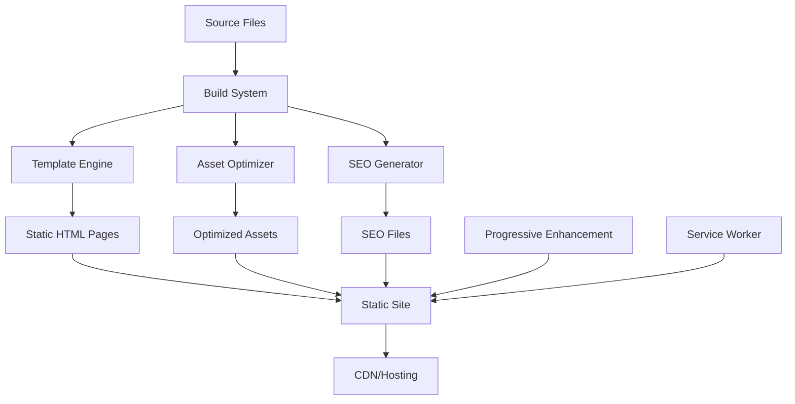

# Complete Static Site Generation (SSG) Implementation Guide

## Table of Contents
1. [Overview](#overview)
2. [Why Choose SSG Over SPA](#why-choose-ssg-over-spa)
3. [Architecture Overview](#architecture-overview)
4. [Implementation Steps](#implementation-steps)
5. [File Structure](#file-structure)
6. [Build System](#build-system)
7. [Template Engine](#template-engine)
8. [Asset Optimization](#asset-optimization)
9. [SEO Implementation](#seo-implementation)
10. [Performance Optimization](#performance-optimization)
11. [Deployment Strategy](#deployment-strategy)
12. [Migration Guide](#migration-guide)
13. [Best Practices](#best-practices)
14. [Troubleshooting](#troubleshooting)

## Overview

This guide provides a comprehensive approach to implementing a simple yet powerful Static Site Generation (SSG) system that replaces basic SPA routing with pre-rendered static pages. The solution maintains all interactive features while eliminating client-side routing limitations.

### Key Benefits
- **SEO Optimization**: Pre-rendered HTML for better search engine indexing
- **Performance**: Faster initial page loads and Core Web Vitals optimization
- **Reliability**: Works without JavaScript (progressive enhancement)
- **Deployment**: Simple static hosting without server requirements
- **Caching**: Optimal CDN and browser caching strategies

## Why Choose SSG Over SPA

### SPA Limitations
- **SEO Challenges**: Search engines struggle with client-side rendered content
- **Performance Issues**: Large JavaScript bundles block initial rendering
- **Complexity**: Client-side routing adds unnecessary complexity for content sites
- **Dependency**: Requires JavaScript to function properly
- **Server Requirements**: Often needs live server for development

### SSG Advantages
- **Better SEO**: Pre-rendered HTML with proper meta tags and structured data
- **Faster Loading**: Critical content renders immediately
- **Progressive Enhancement**: Works without JavaScript, enhanced with it
- **Simple Deployment**: Static files work on any hosting platform
- **Better Caching**: Static assets can be cached aggressively

## Architecture Overview



### Core Components
1. **Template Engine**: Processes templates with data injection
2. **Asset Optimizer**: Minifies, compresses, and optimizes resources
3. **SEO Generator**: Creates sitemaps, meta tags, and structured data
4. **Performance Monitor**: Tracks Core Web Vitals and optimization
5. **Deployment System**: Automated CI/CD for multiple platforms

## Implementation Steps

### Step 1: Project Setup

```bash
# Initialize project structure
mkdir ssg-project && cd ssg-project
npm init -y

# Install dependencies
npm install --save-dev cross-env http-server chokidar-cli
npm install --save-dev lighthouse-ci pa11y-ci bundlesize
```

### Step 2: Create Directory Structure

```
project/
├── src/
│   ├── templates/
│   │   ├── base.html              # Base layout
│   │   ├── home.html              # Home page template
│   │   ├── about.html             # About page template
│   │   ├── contact.html           # Contact page template
│   │   └── partials/              # Reusable components
│   │       ├── navigation.html
│   │       ├── meta-tags.html
│   │       ├── scripts.html
│   │       └── footer.html
│   ├── data/
│   │   ├── site.json              # Global site data
│   │   └── pages.json             # Page configurations
│   └── build/
│       ├── ssg.js                 # Main build script
│       ├── template-engine.js     # Template processor
│       ├── asset-optimizer.js     # Asset optimization
│       ├── seo-generator.js       # SEO utilities
│       └── performance-optimizer.js
├── assets/
│   ├── css/
│   ├── js/
│   └── images/
├── dist/                          # Generated static site
└── package.json
```

### Step 3: Configure Build Scripts

```json
{
  "scripts": {
    "dev": "npm run build:dev && npm run serve:dev",
    "build": "npm run build:production",
    "build:dev": "cross-env NODE_ENV=development node src/build/ssg.js",
    "build:production": "cross-env NODE_ENV=production node src/build/ssg.js",
    "serve:dev": "http-server dist -p 3000 -c-1 --cors",
    "watch": "chokidar 'src/**/*' -c 'npm run build:dev'",
    "test": "npm run test:build && npm run test:accessibility",
    "deploy": "npm run build:production && npm run deploy:github"
  }
}
```

## File Structure

### Generated Static Site Structure
```
dist/
├── index.html                     # Home page (/)
├── about/
│   └── index.html                 # About page (/about/)
├── contact/
│   └── index.html                 # Contact page (/contact/)
├── 404.html                       # Error page
├── sitemap.xml                    # SEO sitemap
├── robots.txt                     # Search engine instructions
├── manifest.json                  # PWA manifest
├── sw.js                          # Service worker
└── assets/
    ├── css/
    │   ├── styles.min.css         # Minified styles
    │   └── styles.min.css.gz      # Gzipped version
    ├── js/
    │   ├── main.min.js            # Progressive enhancement
    │   ├── tetris.min.js          # Interactive features
    │   └── job-features.min.js    # Job-related features
    └── images/
        └── optimized/             # Optimized images
```

## Build System

### Main Build Script (`src/build/ssg.js`)

```javascript
import fs from 'fs/promises';
import path from 'path';
import TemplateEngine from './template-engine.js';
import AssetOptimizer from './asset-optimizer.js';
import SEOGenerator from './seo-generator.js';
import PerformanceOptimizer from './performance-optimizer.js';

class StaticSiteGenerator {
    constructor(config = {}) {
        this.config = {
            srcDir: 'src',
            distDir: 'dist',
            templatesDir: 'src/templates',
            dataDir: 'src/data',
            assetsDir: 'assets',
            ...config
        };
        
        this.templateEngine = new TemplateEngine(this.config);
        this.assetOptimizer = new AssetOptimizer(this.config);
        this.seoGenerator = new SEOGenerator(this.config);
        this.performanceOptimizer = new PerformanceOptimizer(this.config);
    }

    async build() {
        console.log('🚀 Starting SSG build...');
        
        // Clean and prepare
        await this.cleanDist();
        await this.ensureDirectories();
        
        // Load data
        const siteData = await this.loadSiteData();
        const pagesData = await this.loadPagesData();
        
        // Generate pages
        await this.generatePages(pagesData, siteData);
        
        // Optimize assets
        await this.assetOptimizer.process();
        
        // Generate SEO files
        await this.seoGenerator.generate({ site: siteData, pages: pagesData });
        
        // Performance optimization
        if (process.env.NODE_ENV === 'production') {
            await this.performanceOptimizer.optimize();
        }
        
        console.log('✅ SSG build completed successfully!');
    }

    async generatePages(pagesData, siteData) {
        for (const page of pagesData.pages) {
            try {
                const html = await this.templateEngine.render(page, siteData);
                await this.writeFile(page.outputPath, html);
                console.log(`📄 Generated: ${page.outputPath}`);
            } catch (error) {
                console.error(`❌ Failed to generate ${page.outputPath}:`, error);
                throw error;
            }
        }
    }

    async loadSiteData() {
        const siteDataPath = path.join(this.config.dataDir, 'site.json');
        const data = await fs.readFile(siteDataPath, 'utf8');
        return JSON.parse(data);
    }

    async loadPagesData() {
        const pagesDataPath = path.join(this.config.dataDir, 'pages.json');
        const data = await fs.readFile(pagesDataPath, 'utf8');
        return JSON.parse(data);
    }

    async writeFile(relativePath, content) {
        const fullPath = path.join(this.config.distDir, relativePath);
        await fs.mkdir(path.dirname(fullPath), { recursive: true });
        await fs.writeFile(fullPath, content);
    }

    async cleanDist() {
        try {
            await fs.rm(this.config.distDir, { recursive: true, force: true });
        } catch (error) {
            // Directory might not exist
        }
    }

    async ensureDirectories() {
        const dirs = [
            this.config.distDir,
            path.join(this.config.distDir, 'assets'),
            path.join(this.config.distDir, 'assets', 'css'),
            path.join(this.config.distDir, 'assets', 'js'),
            path.join(this.config.distDir, 'assets', 'images')
        ];
        
        for (const dir of dirs) {
            await fs.mkdir(dir, { recursive: true });
        }
    }
}

// Run build if called directly
if (import.meta.url === `file://${process.argv[1]}`) {
    const ssg = new StaticSiteGenerator();
    ssg.build().catch(console.error);
}

export default StaticSiteGenerator;
```

## Template Engine

### Template Engine Implementation (`src/build/template-engine.js`)

```javascript
import fs from 'fs/promises';
import path from 'path';

class TemplateEngine {
    constructor(config) {
        this.config = config;
        this.templateCache = new Map();
        this.partialCache = new Map();
    }

    async render(pageConfig, siteData) {
        // Load page template
        const pageTemplate = await this.loadTemplate(pageConfig.template);
        
        // Process page content
        let content = await this.processTemplate(pageTemplate, {
            site: siteData,
            page: pageConfig.data,
            currentPath: pageConfig.path
        });
        
        // Apply layout
        if (pageConfig.layout) {
            const layout = await this.loadTemplate(pageConfig.layout);
            content = await this.processTemplate(layout, {
                site: siteData,
                page: pageConfig.data,
                content: content,
                currentPath: pageConfig.path,
                navigation: this.generateNavigation(siteData.navigation, pageConfig.path)
            });
        }
        
        return content;
    }

    async processTemplate(template, data) {
        let processed = template;
        
        // Process partials: {{>partial-name}}
        processed = await this.processPartials(processed, data);
        
        // Process conditionals: {{#if condition}}...{{/if}}
        processed = this.processConditionals(processed, data);
        
        // Process loops: {{#each items}}...{{/each}}
        processed = this.processLoops(processed, data);
        
        // Process variables: {{variable}}
        processed = this.processVariables(processed, data);
        
        // Process unescaped: {{{content}}}
        processed = this.processUnescapedVariables(processed, data);
        
        return processed;
    }

    generateNavigation(navigation, currentPath) {
        return navigation.map(item => ({
            ...item,
            active: this.isActivePath(item.url, currentPath)
        }));
    }

    isActivePath(navUrl, currentPath) {
        const normalize = (url) => url.replace(/\/$/, '') || '/';
        return normalize(navUrl) === normalize(currentPath);
    }

    // Additional template processing methods...
    // (Include the full implementation from previous sections)
}

export default TemplateEngine;
```

### Base Template (`src/templates/base.html`)

```html
<!DOCTYPE html>
<html lang="en">
<head>
    <meta charset="UTF-8">
    <meta name="viewport" content="width=device-width, initial-scale=1.0">
    <title>{{page.title}}</title>
    
    {{>meta-tags}}
    {{>critical-css}}
    
    <link rel="icon" href="data:image/svg+xml,<svg xmlns='http://www.w3.org/2000/svg' viewBox='0 0 100 100'><text y='.9em' font-size='90'>♟</text></svg>">
</head>
<body>
    {{>navigation}}
    
    <main class="main-content" role="main">
        {{{content}}}
        
        {{#if page.showTetris}}
        <div class="tetris-container">
            <canvas id="tetris-canvas"></canvas>
        </div>
        {{/if}}
    </main>
    
    {{#if page.showJobFeatures}}
    {{>job-features}}
    {{/if}}
    
    {{>scripts}}
</body>
</html>
```

## Asset Optimization

### CSS Optimization Strategy
1. **Critical CSS Inlining**: Above-the-fold styles inline
2. **Async Loading**: Non-critical CSS loaded asynchronously
3. **Minification**: Remove whitespace and comments
4. **Compression**: Gzip and Brotli versions

### JavaScript Optimization
1. **Progressive Enhancement**: Core functionality without JS
2. **Code Splitting**: Load only necessary features
3. **Minification**: Reduce bundle sizes
4. **Lazy Loading**: Load components on demand

### Performance Budget
```json
{
  "budget": [
    {
      "resourceSizes": [
        { "resourceType": "script", "budget": 150 },
        { "resourceType": "stylesheet", "budget": 50 },
        { "resourceType": "image", "budget": 200 },
        { "resourceType": "total", "budget": 500 }
      ]
    }
  ]
}
```

## SEO Implementation

### Meta Tags Strategy
- **Basic SEO**: Title, description, keywords
- **Open Graph**: Social media sharing optimization
- **Twitter Cards**: Twitter-specific meta tags
- **Structured Data**: JSON-LD for rich snippets

### Sitemap Generation
```xml
<?xml version="1.0" encoding="UTF-8"?>
<urlset xmlns="http://www.sitemaps.org/schemas/sitemap/0.9">
    <url>
        <loc>https://example.com/</loc>
        <lastmod>2024-01-01</lastmod>
        <changefreq>weekly</changefreq>
        <priority>1.0</priority>
    </url>
    <!-- Additional URLs -->
</urlset>
```

### Robots.txt
```
User-agent: *
Allow: /

Sitemap: https://example.com/sitemap.xml

Disallow: /admin/
Disallow: /.git/
```

## Performance Optimization

### Core Web Vitals Optimization
1. **Largest Contentful Paint (LCP)**: Critical CSS inlining
2. **First Input Delay (FID)**: Minimal blocking JavaScript
3. **Cumulative Layout Shift (CLS)**: Fixed element dimensions

### Caching Strategy
```javascript
// Service Worker caching
const CACHE_STRATEGY = {
    static: 'cache-first',     // HTML, CSS, JS
    images: 'cache-first',     // Images, fonts
    api: 'network-first'       // Dynamic content
};
```

### Compression
- **Gzip**: 70-80% size reduction for text files
- **Brotli**: 15-20% better than Gzip
- **Image Optimization**: WebP format with fallbacks

## Deployment Strategy

### Multi-Platform Support
1. **GitHub Pages**: Free hosting with custom domains
2. **Netlify**: Advanced features and edge functions
3. **Vercel**: Optimized for performance
4. **Cloudflare Pages**: Global CDN with edge computing

### CI/CD Pipeline
```yaml
# GitHub Actions workflow
name: Build and Deploy
on:
  push:
    branches: [main]
jobs:
  build-and-deploy:
    runs-on: ubuntu-latest
    steps:
      - uses: actions/checkout@v4
      - uses: actions/setup-node@v4
      - run: npm ci
      - run: npm run build:production
      - run: npm run test
      - uses: actions/deploy-pages@v4
```

### Performance Monitoring
- **Lighthouse CI**: Automated performance audits
- **Bundle Analysis**: Track asset sizes
- **Core Web Vitals**: Real user monitoring

## Migration Guide

### From SPA to SSG Migration Steps

#### 1. Analyze Current SPA Structure
```bash
# Identify current routes
grep -r "route" src/
# Find dynamic content
grep -r "fetch\|axios" src/
# List all pages
find pages/ -name "*.html"
```

#### 2. Create Page Configurations
```json
{
  "pages": [
    {
      "path": "/",
      "outputPath": "index.html",
      "template": "home.html",
      "layout": "base.html",
      "data": {
        "title": "Home Page",
        "description": "Welcome to our site"
      }
    }
  ]
}
```

#### 3. Convert Router Logic
```javascript
// Before (SPA Router)
const routes = {
    "/": "home",
    "/about": "/pages/about.html"
};

// After (Static Navigation)
const navigation = [
    { "label": "Home", "url": "/" },
    { "label": "About", "url": "/about/" }
];
```

#### 4. Update Navigation
```html
<!-- Before (SPA) -->
<a href="/about" onclick="route(event)">About</a>

<!-- After (Static) -->
<a href="/about/">About</a>
```

#### 5. Preserve Interactive Features
```javascript
// Progressive enhancement approach
if (typeof window !== 'undefined') {
    // Client-side enhancements
    new TetrisAnimation();
    new JobFeatures();
}
```

### Migration Checklist
- [ ] Identify all routes and pages
- [ ] Convert dynamic routing to static pages
- [ ] Update navigation links
- [ ] Preserve interactive features
- [ ] Configure build system
- [ ] Set up deployment pipeline
- [ ] Test all functionality
- [ ] Validate SEO improvements
- [ ] Monitor performance metrics

## Best Practices

### Development Workflow
1. **Local Development**: Use watch mode for rapid iteration
2. **Testing**: Automated tests for build and accessibility
3. **Performance**: Regular Lighthouse audits
4. **SEO**: Validate meta tags and structured data

### Code Organization
1. **Separation of Concerns**: Templates, data, and logic separated
2. **Reusable Components**: Partials for common elements
3. **Configuration**: Environment-specific settings
4. **Documentation**: Clear comments and README files

### Performance Guidelines
1. **Critical Path**: Inline critical CSS and JavaScript
2. **Lazy Loading**: Load non-essential resources on demand
3. **Compression**: Enable Gzip/Brotli compression
4. **Caching**: Implement proper cache headers

### SEO Best Practices
1. **Semantic HTML**: Use proper heading hierarchy
2. **Meta Tags**: Unique titles and descriptions for each page
3. **Structured Data**: Implement relevant schema markup
4. **Accessibility**: Follow WCAG guidelines

## Troubleshooting

### Common Issues and Solutions

#### Build Failures
```bash
# Check Node.js version
node --version  # Should be 16+ for ES modules

# Clear cache and reinstall
rm -rf node_modules package-lock.json
npm install

# Debug build process
DEBUG=* npm run build:dev
```

#### Template Errors
```javascript
// Add error handling to template engine
try {
    const html = await this.templateEngine.render(page, siteData);
} catch (error) {
    console.error(`Template error in ${page.template}:`, error);
    // Provide fallback or detailed error info
}
```

#### Performance Issues
```bash
# Analyze bundle sizes
npm run audit:bundle

# Run Lighthouse audit
npm run audit:performance

# Check compression ratios
ls -la dist/assets/css/
```

#### SEO Problems
```bash
# Validate HTML
npx html-validate dist/index.html

# Check meta tags
curl -s https://example.com | grep -i "<meta"

# Validate structured data
# Use Google's Structured Data Testing Tool
```

### Debug Mode
```javascript
// Enable debug logging
const DEBUG = process.env.DEBUG || false;

if (DEBUG) {
    console.log('Template data:', JSON.stringify(data, null, 2));
    console.log('Generated HTML preview:', html.substring(0, 200));
}
```

### Performance Monitoring
```javascript
// Add performance timing
console.time('Build Process');
await this.build();
console.timeEnd('Build Process');

// Monitor memory usage
const used = process.memoryUsage();
console.log('Memory usage:', {
    rss: Math.round(used.rss / 1024 / 1024) + 'MB',
    heapUsed: Math.round(used.heapUsed / 1024 / 1024) + 'MB'
});
```

## Conclusion

This SSG implementation provides a robust foundation for creating high-performance, SEO-optimized static websites while maintaining the interactive features of modern web applications. The progressive enhancement approach ensures accessibility and reliability across all devices and browsers.

### Key Takeaways
1. **Simplicity**: Keep the build system simple and maintainable
2. **Performance**: Prioritize Core Web Vitals and user experience
3. **SEO**: Implement comprehensive SEO optimization
4. **Flexibility**: Design for easy customization and extension
5. **Reliability**: Ensure the site works without JavaScript

### Next Steps
1. Implement the build system following this guide
2. Customize templates and styling for your needs
3. Set up automated deployment pipeline
4. Monitor performance and SEO metrics
5. Iterate and improve based on real-world usage

For additional support and updates, refer to the project repository and documentation.